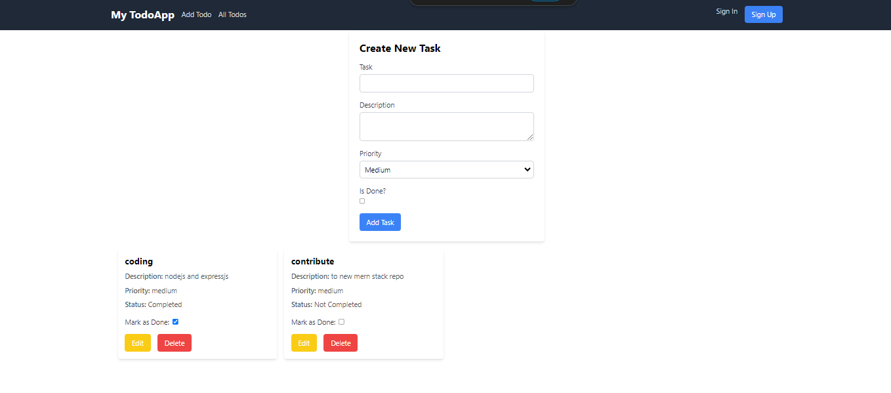
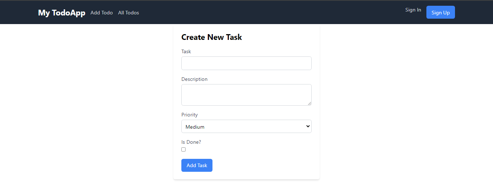
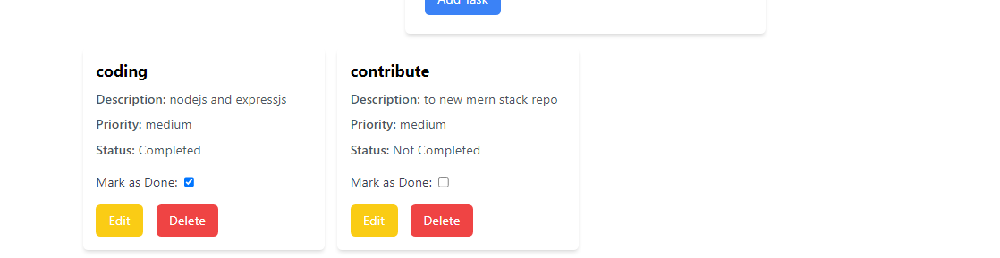
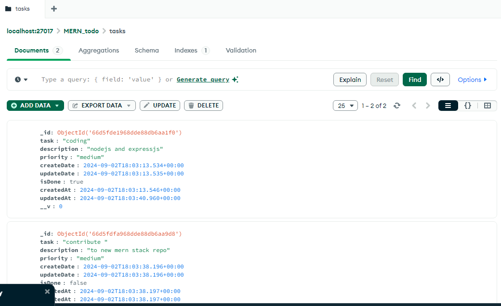

# TodoMern

TodoMern is a comprehensive task management application built with the MERN stack (MongoDB, Express.js, React, Node.js). It enables users to manage tasks effectively, providing functionality to create, edit, toggle, and delete tasks.

## Screenshots






## Prerequisites

To run TodoMern, you need to have the following installed:

- **Node.js**: Download and install the latest LTS version from [Node.js official website](https://nodejs.org/).
- **npm**: Node.js includes npm (Node Package Manager). Check its installation by running `npm -v` in your terminal.
- **MongoDB**: Install MongoDB from the [MongoDB website](https://www.mongodb.com/try/download/community) or use a cloud-based service like [MongoDB Atlas](https://www.mongodb.com/cloud/atlas).

## Getting Started

To set up and run TodoMern, follow these steps:

### 1. Clone the Repository

```bash
git clone https://github.com/inaveed-git/TodoMern.git
cd TodoMern
```

### 2. Set Up the Backend

1. **Navigate to the backend directory:**

   ```bash
   cd backend
   ```

2. **Install the backend dependencies:**

   ```bash
   npm install
   ```

3. **A Created `.env` file** in the `backend` directory with the following configuration:

   ```env
   MONGODB_URL=mongodb://127.0.0.1:27017/todoMern
   PORT=5000

   ```

4. **Start the backend server:**

   ```bash
   npm run dev
   ```

   The backend server will run on `http://localhost:####`.

### 3. Set Up the Frontend

1. **Navigate to the frontend directory:**

   ```bash
   cd ../frontend
   ```

2. **Install the frontend dependencies:**

   ```bash
   npm install
   ```

3. **Start the frontend development server:**

   ```bash
   npm run dev
   ```

   The frontend will be available at `http://localhost:###`.

### 4. Access the Application

- **Frontend:** Open `http://localhost:####` in your web browser to interact with the TodoMern application.
- **Backend:** The backend server runs at `http://localhost:####`, handling API requests.

## Features

- **Task Management:** Create, edit, toggle the completion status, and delete tasks.
- **Responsive Design:** Optimized for both mobile and desktop views.
- **Task Filtering:** View tasks with their completion status.

## Contact

For any questions or feedback, please contact [inaveed.contact@gmail.com](mailto:your-email@example.com).

```

```

# React + Vite

This template provides a minimal setup to get React working in Vite with HMR and some ESLint rules.

Currently, two official plugins are available:

- [@vitejs/plugin-react](https://github.com/vitejs/vite-plugin-react/blob/main/packages/plugin-react/README.md) uses [Babel](https://babeljs.io/) for Fast Refresh
- [@vitejs/plugin-react-swc](https://github.com/vitejs/vite-plugin-react-swc) uses [SWC](https://swc.rs/) for Fast Refresh
